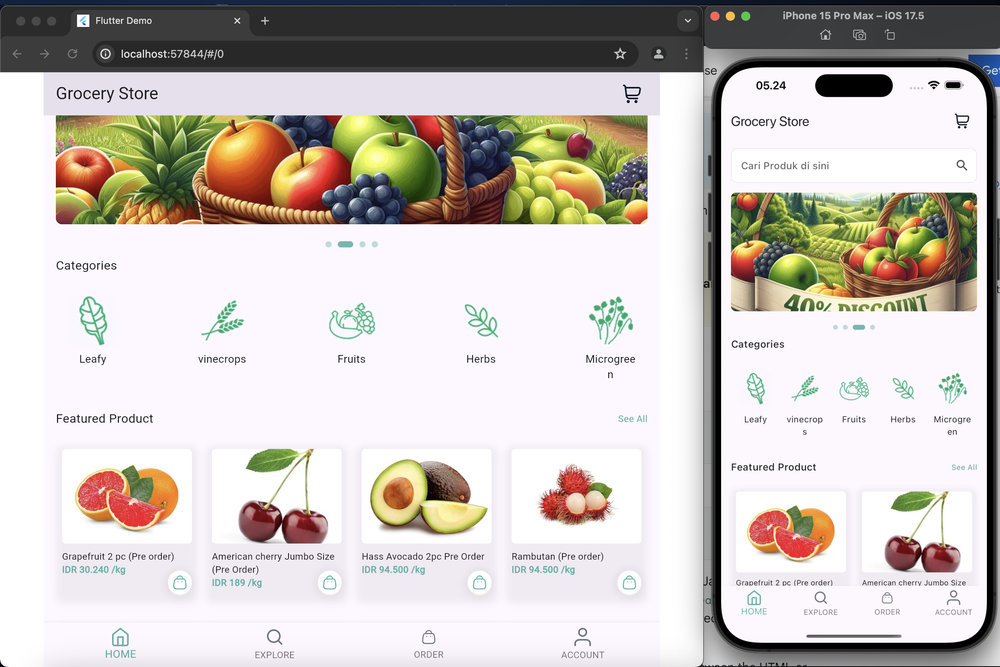

## app result


## app preview youtube
[](https://www.youtube.com/watch?v=_I88sPDfRi0)


## Getting Started

This project is a starting point for a Flutter application.

A few resources to get you started if this is your first Flutter project:

- [Lab: Write your first Flutter app](https://docs.flutter.dev/get-started/codelab)
- [Cookbook: Useful Flutter samples](https://docs.flutter.dev/cookbook)

For help getting started with Flutter development, view the
[online documentation](https://docs.flutter.dev/), which offers tutorials,
samples, guidance on mobile development, and a full API reference.

## docker build for web
- docker build -t flutter-web .
- docker run -d -p 8080:80 --name flutter-web flutter-web


## android build
- expected to be running without note

## web build 
- make sure you flutter doctor all green
- flutter build web make sure green if not; try run this command first: 
flutter pub upgrade
- if chrome not show on your selected device vscode; run this command first:
flutter config --enable-web
- flutter run -d chrome

## iOS build 
- follow this instruction; make sure you setup all correctly.
https://docs.flutter.dev/get-started/install/macos/mobile-ios
- flutter run

## rajaongkir key
put your rajaongkir api key

```dart
class VariablesPrivate {
  static const String _rajaOngkirStarterKey = 'PUT_YOUR_KEY';
  static const String _rajaOngkirProKey = 'PUT_YOUR_KEY';

  static String get rajaOngkierKey =>
      Variables.usingPro ? _rajaOngkirProKey : _rajaOngkirStarterKey;
}

